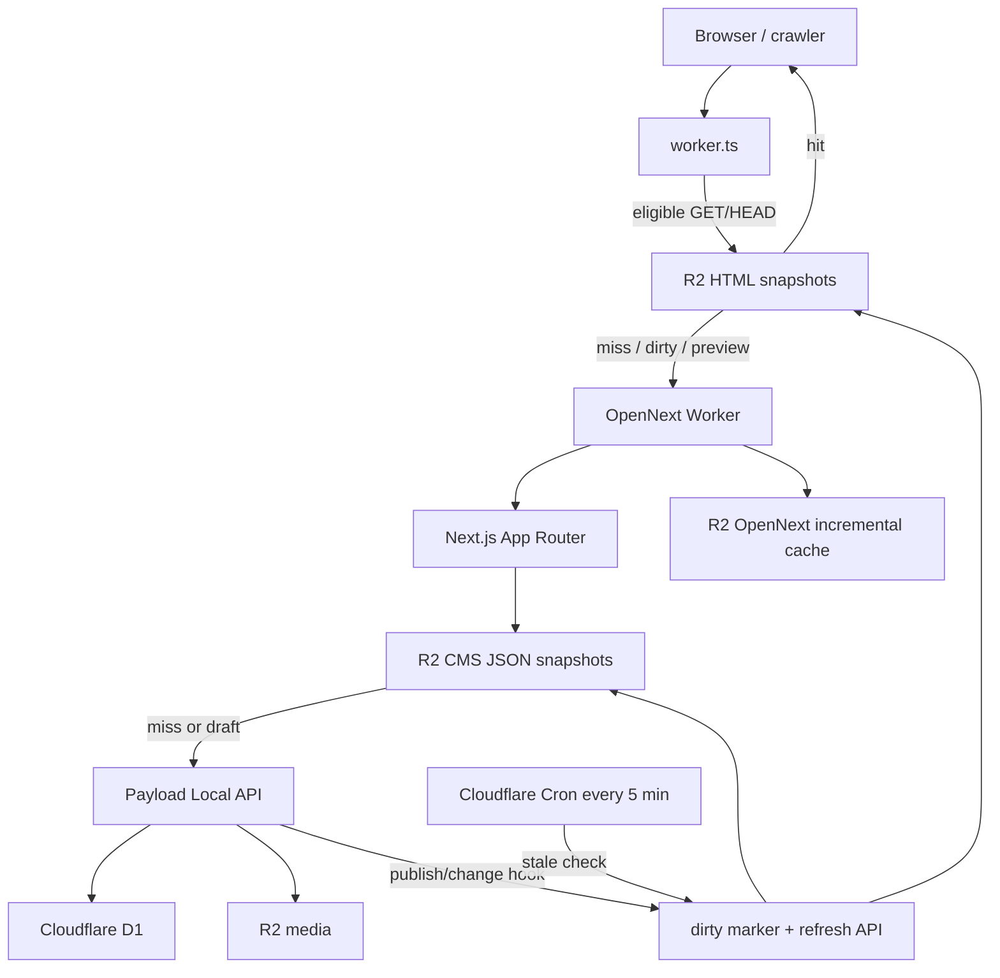

# Noumi Official Website 完整交接与运维手册

## 1. 文档基线

| 项目      | 基线                           |
| --------- | ------------------------------ |
| 审阅日期  | 2026-08-13                     |
| 审阅分支  | `main`                         |
| 审阅提交  | `411a8b2`                      |
| Canonical | `https://noumi.ai`             |
| Worker    | `noumi-official-website`       |
| CMS       | Payload CMS 3.81               |
| 部署形态  | OpenNext on Cloudflare Workers |

本文来自对当前仓库源码、迁移、配置和测试的完整静态审阅，是后续开发和运维的主要交接基线。它说明的是“当前 checkout 中实现了什么”，不能证明以下外部状态：

- 当前生产环境实际部署的是哪个 commit。
- Cloudflare 账号中 secret、custom domain、Worker route、DNS 的真实状态。
- D1 中现有内容、用户和动态 slug 的具体数据。
- GA4、PostHog、Google Form、产品服务和域名账号的实际所有权。

生产操作前必须在对应平台再次核实。不要把本文中的资源名理解为远端资源一定存在，也不要把任何真实密钥补进本文。

## 2. 项目说明

本项目是 Noumi 官方网站的完整 Web/CMS 工程，职责包括：

- 公开营销页面与内容详情页。
- Payload Admin、REST API、GraphQL 和草稿预览。
- Blog、Feature、Use Case、FAQ、法律页面、友链和 Invite 数据管理。
- D1 schema、版本表和 migrations。
- R2 媒体存储、CMS JSON 快照、页面 HTML 快照和 OpenNext 缓存。
- SEO metadata、JSON-LD、sitemap、robots、GA4、PostHog 和 cookie consent。
- Cloudflare Worker、Cron、日志和部署配置。

本项目不负责 Noumi 产品站本身。官网 CTA 跳转到 `https://www.noumi.ai/auth`，产品账号、注册、审批和实际应用能力由外部产品服务负责。

## 3. 演进背景与维护原则

### 3.1 前端历史

官网前端最初为了紧急上线，由已有静态 HTML 页面快速派生到 Next.js。当前代码已经稳定承载正式站点，但保留了以下历史形态：

- 页面组件中仍有较大段静态 JSX。
- class 名和 DOM 层次部分沿用原 HTML。
- 页面之间没有全部抽象为统一 section/component schema。
- SEO/JSON-LD 中仍有部分静态常量，可能与 CMS 内容分开维护。

CSS 已经从页面代码中拆出，不再以页面内联 CSS 作为主要维护方式：

- `src/app/(frontend)/official-base.css`：全站基础变量、reset 和共享样式。
- `src/app/(frontend)/official-home.css`：首页及当前正式 chrome 的共享视觉样式。
- `src/app/(frontend)/**/**.module.css`：多数视觉独立路由的专属 CSS Module。
- `src/app/(frontend)/styles.css`：旧样式文件，当前正式前台没有入口引用。

首页使用 `official-home.css`；Privacy/Terms 等结构化法律页复用共享内容组件样式；`/invite` 当前直接重定向，因此其旧 CSS 不在可见页面主链路。维护时以实际 import 为准，不要仅按文件存在判断是否生效。

### 3.2 默认维护策略

- 优先保持现有 URL、DOM 语义、视觉和 CMS 字段兼容。
- 页面小改动优先修改本页 CSS Module；不要继续扩大共享 CSS 的影响范围。
- 不在没有跨页面视觉回归时合并多个页面 CSS。
- 不为了“整洁”一次性重写全部 HTML 派生页面。
- 新页面可使用更清晰的结构，但应兼容现有 header/footer、metadata、analytics 和 snapshot 链路。
- Raw HTML 是特殊迁移/发布能力，不应继续扩散到所有内容模型。

### 3.3 Public 资产

`public` 根目录保存 favicon、logo、`robots`/部署约定文件和 `llms*.txt`；业务图片位于 `public/assets`：

```text
public/assets/
├── home/          首页图片
├── blog/          Blog 静态资产
├── features/      Feature 静态资产
├── use-cases/     Use Case 图片和头像
├── pricing/       Pricing 装饰
├── links/         Links 页面资产
├── logos/         信任墙 Logo
├── product/       产品截图
├── social/        OG/社交分享图
└── legacy/        迁移遗留资产
```

`public/assets/legacy` 和文件名中带 legacy 不代表可以直接删除。先用 `rg` 检查源码、CMS Raw HTML 和生产内容引用；CMS 中保存的 HTML/URL 不一定能从 Git 搜到。

## 4. 运行架构



### 4.1 请求主链路

1. 所有公开请求先进入根目录 `worker.ts`。
2. 无 query、无 preview cookie、无 bypass header 的规范 GET/HEAD 页面请求会尝试读取 R2 HTML 快照。
3. 快照命中时返回 `x-official-snapshot: hit`，并跳过 OpenNext/Next/Payload。
4. 快照缺失、dirty、资源版本不兼容或请求不符合条件时进入 OpenNext Worker。
5. Next 页面需要 CMS 发布态数据时，`official-cms.ts` 优先读取 R2 JSON 快照。
6. JSON 快照缺失时才回源 Payload Local API 和 D1。
7. OpenNext 响应满足条件时，Worker 在后台机会性回填当前路由的 HTML 快照。

### 4.2 草稿请求

前台 layout 为 `force-dynamic`，目的是保留 Payload draft preview。带 Next preview cookie 的请求绕过 HTML 快照，CMS 读取也绕过发布态 JSON 快照和 `unstable_cache`，直接读取 draft 数据。

因此，本项目不是构建期 SSG。公开性能主要依赖：

- R2 页面 HTML 快照。
- R2 CMS JSON 快照。
- OpenNext R2 incremental cache。
- Next 发布态 CMS 读取的 `unstable_cache`。

## 5. 代码结构与入口

```text
src/
├── access/cms.ts                    CMS 角色和 access policy
├── app/(frontend)/                  正式公开路由
├── app/(payload)/                   Payload Admin/REST/GraphQL
├── app/api/site/                    官网业务与运维 API
├── app/api/temporary-ui/            旧 URL 兼容转发，不代表 Invite 仍是临时模型
├── app/my-route/                    Payload 模板遗留示例接口
├── collections/                     Payload collections
├── globals/                         Payload globals
├── fields/htmlRenderMode.ts         整页 HTML 模式字段
├── fields/marketingContent.ts       通用营销字段
├── components/site/official/        正式站点组件与 Raw HTML 渲染器
├── components/admin/                Snapshot Admin 控制组件
├── lib/site/official-cms.ts         CMS 查询、映射、默认值与快照生成
├── lib/site/publishing.ts           drafts、version、preview
├── lib/site/official-snapshot-store.ts
│                                      R2 JSON/meta/dirty/lock
├── lib/site/official-snapshot-hooks.ts
│                                      内容变更后的标脏/刷新
├── lib/site/payload-client.ts       Payload client 初始化缓存
├── lib/site/analytics.ts            GA4/PostHog 配置与事件清洗
├── lib/site/official-site.ts        canonical、产品 URL、favicon/OG 常量
├── migrations/                      Payload/D1 migrations
├── payload-types.ts                 生成文件
└── payload.config.ts                Payload、D1、R2、plugins 主配置

worker.ts                             OpenNext Worker 包装和 HTML snapshot
wrangler.jsonc                        Cloudflare source of truth
open-next.config.ts                   R2 incremental cache 配置
next.config.ts                        Next/Payload/Workers 打包兼容
scripts/patch-opennext-env-shim.mjs   构建前 node_modules 兼容补丁
cloudflare-env.d.ts                   Wrangler 生成类型，不是运行时配置源
```

### 5.1 关键入口

| 目的                | 入口                                               |
| ------------------- | -------------------------------------------------- |
| Payload schema/插件 | `src/payload.config.ts`                            |
| 公开 CMS view model | `src/lib/site/official-cms.ts`                     |
| 角色/权限           | `src/access/cms.ts`                                |
| Draft/preview       | `src/lib/site/publishing.ts`                       |
| Raw HTML            | `src/components/site/official/OfficialRawHtml.tsx` |
| JSON snapshot       | `src/lib/site/official-snapshot-store.ts`          |
| HTML snapshot/Cron  | `worker.ts`                                        |
| Cloudflare 资源     | `wrangler.jsonc`                                   |
| DB 迁移顺序         | `src/migrations/index.ts`                          |
| 部署命令            | `package.json`                                     |

## 6. 前台路由与数据来源

动态文档的实际 slug 存在 D1，仓库只能确认路由模式，不能确认生产中有哪些实例。

| 路由                | 主体数据来源 | CMS 现状                                                                      | 样式/备注                                 |
| ------------------- | ------------ | ----------------------------------------------------------------------------- | ----------------------------------------- |
| `/`                 | 静态 JSX     | 外层 Feature/Use Case 导航读 CMS                                              | `official-home.css`                       |
| `/about`            | 主体静态     | 团队成员和 About FAQ 来自 `about-page`                                        | `about.module.css`                        |
| `/contact`          | 静态 JSX     | 未进 CMS                                                                      | `contact.module.css`                      |
| `/pricing`          | 静态 JSX     | 套餐、FAQ、CTA 未进 CMS                                                       | `pricing.module.css`                      |
| `/features`         | 混合         | 卡片、角色、FAQ、OG 图来自 `features-page`；部分区块静态；有代码默认值        | `features.module.css`                     |
| `/features/[slug]`  | CMS          | 已发布 `feature-pages`，支持 template/raw HTML                                | `feature-page.module.css`                 |
| `/use-cases`        | 混合         | 卡片/FAQ/OG 图来自 `use-cases-page`，导航来自 `use-case-pages`；Hero/CTA 静态 | `use-cases.module.css`                    |
| `/use-cases/[slug]` | CMS          | 已发布 `use-case-pages`，支持 template/raw HTML                               | `use-case.module.css`                     |
| `/blog`             | CMS          | 已发布 `blog-posts` 列表                                                      | `blog.module.css`；订阅输入目前无提交逻辑 |
| `/blog/[slug]`      | CMS          | 已发布 `blog-posts`，支持 template/raw HTML                                   | `blog-post.module.css`                    |
| `/faqs`             | CMS          | `faq-page` 控制 template/raw HTML；template 读取启用的 `faq-items`            | `faqs.module.css`                         |
| `/privacy`          | CMS          | `privacy-page` template/raw HTML                                              | 结构化模式复用共享 section 样式           |
| `/terms`            | CMS          | `terms-page` template/raw HTML                                                | 结构化模式复用共享 section 样式           |
| `/links`            | 混合         | 页面框架静态，卡片来自启用的 `friendly-links`                                 | `links.module.css`                        |
| `/invite`           | 重定向       | Invite collection 是正式模型，但当前不展示申请页                              | 跳 `https://www.noumi.ai/auth`            |
| `/robots.txt`       | 运行时生成   | 不依赖 CMS                                                                    | 当前允许全部 crawler                      |
| `/sitemap.xml`      | 运行时生成   | 动态 Blog/Feature/Use Case 来自 CMS                                           | 当前未包含 `/links` 和 `/invite`          |

### 6.1 正式站点外层

`OfficialPersistentChrome` 在 layout 层读取 Feature/Use Case 导航，并渲染固定 header/footer。当前正式站点的主导航、CTA、公司/资源/法律链接和版权文字主要写在 `OfficialHomeChrome.tsx`，不是由 `site-settings` 驱动。

`SiteSettings`、`SiteHeader`、`SiteFooter`、`src/lib/site/cms.ts` 仍存在，但不能据此宣称后台站点设置已经完整接线。修改 `site-settings` 导航/页脚字段目前不会自动改变正式 chrome。

## 7. Payload CMS 实现

### 7.1 Collections

| Slug              | 用途                  | Draft/version          | 公开读取                       | 备注                                             |
| ----------------- | --------------------- | ---------------------- | ------------------------------ | ------------------------------------------------ |
| `users`           | Admin 用户与角色      | 否                     | 否                             | 首个用户自动 admin，后续默认 viewer              |
| `media`           | 上传文件              | 否                     | 是                             | 文件存 R2；Workers 不支持 crop/focal point       |
| `blog-posts`      | Blog                  | 是，单文档最多 50 版本 | 仅 Payload `_status=published` | template/raw HTML；另有自定义 editorial `status` |
| `feature-pages`   | Feature 子页          | 是                     | 仅 published                   | template/raw HTML                                |
| `use-case-pages`  | Use Case 子页         | 是                     | 仅 published                   | template/raw HTML                                |
| `faq-items`       | FAQ 条目              | 否                     | Payload API 全部公开           | 正式前台额外过滤 `isActive=true`                 |
| `friendly-links`  | `/links` 卡片         | 否                     | 匿名仅 active                  | 支持手填或 HTML badge 字段提取                   |
| `invite-requests` | 正式 Invite 申请数据  | 否                     | 仅 admin                       | 公开提交当前关闭；服务同步保留                   |
| `redirects`       | Redirects plugin 生成 | plugin 管理            | 需重新核实 plugin 默认 access  | 当前前台没有发现消费该集合的跳转逻辑             |

Payload 还会维护 preferences、migrations、versions、locks 等内部表，不应把这些表作为业务 API 直接操作。

### 7.2 Globals

所有以下 globals 都启用 drafts/version，最多保留 50 个版本：

| Slug             | 用途                                          | 正式前台消费情况                                        |
| ---------------- | --------------------------------------------- | ------------------------------------------------------- |
| `site-settings`  | 品牌、导航、页脚、默认 SEO、Snapshot Admin UI | Snapshot 控件生效；导航/页脚等主要字段未接入正式 chrome |
| `features-page`  | Features 聚合页卡片、FAQ、OG                  | 部分生效；页面另有静态区块和代码默认值                  |
| `use-cases-page` | Use Cases 聚合页卡片、FAQ、OG                 | 部分生效                                                |
| `about-page`     | 团队与 About FAQ                              | 生效                                                    |
| `faq-page`       | FAQ template/raw HTML 开关                    | 生效                                                    |
| `privacy-page`   | Privacy template/raw HTML                     | 生效                                                    |
| `terms-page`     | Terms template/raw HTML                       | 生效                                                    |

### 7.3 Plugin

- `@payloadcms/storage-r2`：`media` 文件存入 `R2` binding。
- `@payloadcms/plugin-seo`：为 Blog、Feature、Use Case 和 SiteSettings 增加 SEO 管理字段/预览。
- `@payloadcms/plugin-redirects`：目标集合当前只包含 Blog 和 Use Case；前台没有发现主动查询 redirects collection 的实现，不应假设旧 URL 已自动生效。
- Lexical：作为 Payload 富文本 editor；前台部分结构最终映射为 Markdown/HTML/section view model。

### 7.4 已进 CMS 与未进 CMS

已进 CMS：

- Blog 列表与详情。
- Feature 子页、Use Case 子页。
- Features/Use Cases 聚合页的部分卡片、FAQ 和分享图。
- About 团队成员和 FAQ。
- FAQ 页面及 FAQ items。
- Privacy、Terms。
- 友链卡片。
- Payload 媒体。
- Invite 申请记录和后台状态。
- SiteSettings schema 与 Snapshot 控制 UI。

未进 CMS 或未完整接线：

- 首页主体文案和图片。
- Contact 全部主体。
- Pricing 套餐、价格、FAQ 和 CTA。
- About 大部分主体文案。
- Features 的 Hero、How it works、部分 CTA。
- Use Cases 的 Hero 和底部 CTA。
- 正式 header/footer 的大部分文案与链接。
- GA4 ID、canonical、产品 auth URL、部分 JSON-LD/SEO 常量。
- Beta banner 的 Google Form URL。
- Blog 订阅后端逻辑。
- 完整中英文路由和 locale-aware snapshot。

### 7.5 Friendly Links 的 HTML 输入

`friendly-links` 的 HTML 模式与“整页 Raw HTML”不是同一能力。它只解析形如 `<a></a>` 的 badge 片段，并提取：

- `href`
- `avatarUrl`
- `title`
- `description`

前台最终渲染标准 React 卡片，不直接执行粘贴的 HTML。

## 8. 角色与权限

### 8.1 角色矩阵

| 能力                        | admin | content-editor | legal-editor | translator | viewer |
| --------------------------- | ----- | -------------- | ------------ | ---------- | ------ |
| 管理用户/角色               | 是    | 否             | 否           | 否         | 否     |
| 读取/更新本人账号           | 是    | 是             | 是           | 是         | 是     |
| 创建营销文档                | 是    | 是             | 否           | 否         | 否     |
| 更新营销文档                | 是    | 是             | 否           | 是         | 否     |
| 删除营销文档                | 是    | 是             | 否           | 否         | 否     |
| 上传/更新媒体               | 是    | 是             | 否           | 是         | 否     |
| 删除媒体                    | 是    | 是             | 否           | 否         | 否     |
| 编辑通用 Raw HTML 字段      | 是    | 是             | 否           | 否         | 否     |
| 更新 Privacy/Terms          | 是    | 否             | 是           | 是         | 否     |
| 编辑 Privacy/Terms Raw HTML | 是    | 否             | 否           | 否         | 否     |
| 查看/处理 Invite            | 是    | 否             | 否           | 否         | 否     |
| Snapshot 状态/设置/刷新     | 是    | 是             | 是           | 是         | 否     |

### 8.2 容易误解的权限

- `admin` 通过 `hasAnyCmsRole` 自动拥有所有项目自定义能力。
- `translator` 对营销文档是整文档 update，不只限 localized 文本；它可以修改 slug、排序、关系等普通字段，但不能写 Raw HTML 字段。
- Privacy/Terms 的 global update 允许 legal-editor/translator，而 HTML 字段只允许 content-editor/admin。两个条件的交集导致非 admin 无法编辑法律页 Raw HTML。
- `faq-items` 的 collection read 是完全公开；inactive 只在正式前台 loader 中过滤，直接 Payload API 仍可能读到。
- Payload Local API 默认可绕过 access。本项目发布态查询通常显式约束 access；draft preview 由 preview secret/cookie 作为高权限边界。
- Redirects plugin 没有自定义 access override，投入使用前需要单独验证权限和前台执行方式。

## 9. Draft、发布与 Preview

### 9.1 发布状态

Blog、Feature、Use Case 和全部页面 Globals 使用 Payload drafts/version：

- 生产环境 autosave 开启。
- 本地默认关闭 autosave，可用 `PAYLOAD_ENABLE_DEV_AUTOSAVE=true` 开启。
- 支持 schedule publish。
- 公开集合读取只认 Payload `_status=published`。

Blog 另有自定义字段 `status=draft/review/published`，它只代表编辑流程元数据。不能把它与 Payload `_status` 混用；即使自定义 `status=published`，只要 `_status` 不是 published，公开读取仍不可见。

### 9.2 Preview

- 进入：`GET /api/preview?secret=...&path=...&locale=...`。
- 退出：`GET /api/preview/exit?path=...`。
- Secret：优先 `PAYLOAD_PREVIEW_SECRET`，缺失时回退 `PAYLOAD_SECRET`。
- Preview cookie 由 Next draft mode 管理。
- 生产配置会启用 Payload Admin live preview；本地需 `PAYLOAD_ENABLE_DEV_LIVE_PREVIEW=true`。

当前仓库存在 `PayloadLivePreviewListener.tsx`，但未发现其在正式 layout/page 中挂载。因此“打开草稿 URL”可工作，不应宣称 Payload live-preview 消息驱动的无刷新实时更新已完整接线。

Preview secret 能读取未发布内容，应按生产 secret 管理。已知风险见“风险登记”：exit path 处理和 preview HTML 回填都需要后续修复/验证。

### 9.3 内容发布检查

1. 确认目标 locale 和字段内容。当前正式读取等同默认英语，不要误以为中文已独立发布。
2. 用 Preview 检查页面、metadata、移动端和站内链接。
3. 确认最终操作是 Payload Publish，而不是只修改 Blog 自定义 `status`。
4. 发布后到 Site Settings 的 Snapshot 控件查看 dirty/refresh 状态。
5. 必要时点击“立即刷新”。
6. 无 preview cookie 访问正式 URL，并检查 `x-official-snapshot` 与最终内容。
7. 变更 slug 时手工核实旧 URL；不要默认 redirects plugin 已接管。

## 10. CMS 整页 HTML 特殊渲染

### 10.1 适用模型

支持 `template`/`html` 两种模式的模型：

- `blog-posts`
- `feature-pages`
- `use-case-pages`
- `faq-page`
- `privacy-page`
- `terms-page`

不支持整页 Raw HTML 的主要模型：

- `about-page`
- `features-page`
- `use-cases-page`
- `faq-items`
- `friendly-links`
- `invite-requests`

### 10.2 为什么存在

该模式用于承接早期静态 HTML 或外部交付 HTML，在不先完成完整结构化建模的情况下快速上线。它用迁移效率换取结构、安全和长期可维护性，不是常规富文本能力。

### 10.3 实际处理过程

`OfficialRawHtml` 会：

1. 如果输入是完整文档，提取 `<body>` 内容；否则使用整个片段。
2. 收集输入中的 `<style>`，并在内容顶部重新注入。
3. 移除粘贴内容中的 `<nav>`、`<footer>` 和特定遗留空容器，避免与站点 chrome 重复。
4. 尝试解包最外层 `.page-body`。
5. 把站内 `href` 规范为无 trailing slash 的首选 URL。
6. 为站内普通链接接入 App Router push/prefetch。
7. 保留内联 JSON-LD，并让它进入首屏 SSR HTML。
8. 删除外链 `<script src="...">`。
9. 在 hydration 后重新执行内联 classic JavaScript 和 `type=module` 脚本。
10. 注入移动端兜底 CSS，限制媒体、表格和常见 grid 溢出。

### 10.4 安全边界

Raw HTML 不是 sanitizer，也不是 iframe sandbox：

- 内联脚本会执行。
- DOM event attribute 仍可能执行。
- iframe、form 和其他 HTML 能力没有统一 allowlist。
- 粘贴的 CSS 没有作用域隔离，可污染 header/footer 和其他全局元素。
- HTML 中 `<head>` 的 title/meta 不会自动变成 Next metadata；JSON-LD 是特殊保留项。
- 仅移除外部 script tag 不等于阻止所有外部请求。

因此，写入 Raw HTML 等价于获得部分前端代码发布权限。只允许可信内部人员粘贴经过审阅的代码；不要接受用户输入、未知第三方 snippet 或未经安全审查的生成内容。

Features、Use Cases、About 的部分 FAQ answer 还允许少量 HTML，并以 `dangerouslySetInnerHTML` 输出，但没有同样严格的字段角色限制。即使不是整页 HTML，也应只写可信、最小化的标签。

### 10.5 HTML 内容交付规范

- 优先提供 body 主体，不要依赖完整 `<html>/<head>`。
- 不要重复提供站点 navbar/footer。
- 不要依赖外部 script；渲染器会移除。
- CSS selector 尽量挂在页面唯一根 class 下，减少全局污染。
- 不要覆盖 `html`、`body`、`.page-shell`、站点 header/footer 的全局布局。
- 站内链接使用 canonical 无 trailing slash 路径。
- 图片使用稳定的 HTTPS URL 或先上传 Payload Media。
- Metadata 仍在 CMS SEO 字段/页面代码中维护。
- Blog HTML 模式同时填写列表卡片字段，否则列表页可能只回退到 slug。
- 每次修改至少检查桌面、移动端、preview、正式发布和 snapshot 命中版本。

## 11. Invite 实现说明

Invite 不是临时 collection。正式模型为 `invite-requests`，包含邮箱、处理状态、来源路径、IP、User-Agent、提交时间和内部备注。

当前产品行为分为三条链路：

| 链路                  | 当前行为                                                     |
| --------------------- | ------------------------------------------------------------ |
| Beta banner           | 跳外部 Google Form，URL 写在 `OfficialBetaBanner.tsx`        |
| Try Free 与 `/invite` | 跳 `https://www.noumi.ai/auth`                               |
| D1 Invite 数据        | collection 与服务同步 API 保留，公开提交/lookup 被代码硬关闭 |

API 现状：

- `POST /api/site/invite-requests`：当前直接返回产品 auth action，不写 D1。
- `POST /api/site/invite-requests/lookup`：当前直接返回产品 auth action。
- `GET /api/site/invite-requests`：Bearer token 保护，供产品服务拉取历史/现有申请。
- `PATCH /api/site/invite-requests`：Bearer token 保护，供产品服务回写状态。
- `/api/temporary-ui/invite-request`：旧 URL 兼容 re-export，不代表业务仍是临时实现。

若恢复公开 waitlist，至少先补：限流/CAPTCHA、隐私告知、数据保留策略、分页同步、滥用监控和 E2E。当前同步 GET 最多读取 1000 条且无分页，PATCH 为串行更新。

## 12. Snapshot 与缓存

### 12.1 R2 key 布局

默认前缀为 `official-site-snapshots`：

```text
official-site-snapshots/
├── data/<business-key>.json       CMS JSON view model
├── html/<route>/index.html        公开页面 HTML
├── manifest.json                  当前 JSON keys、routes、数量与时间
├── dirty.json                     内容变更标记
├── settings.json                  Admin 保存的 refreshSeconds
└── refresh-lock.json              5 分钟刷新锁
```

首页 HTML key 为 `official-site-snapshots/html/index/index.html`。

同一个 bucket 还包含：

- Payload Media plugin 写入的媒体对象。
- `next-incremental-cache` 前缀下的 OpenNext cache。

任何清理都必须限定 key/prefix，禁止清空整个 bucket。

Snapshot/ViewModel 中的 `caseNavItems`、`casePage`、`casesPage` 都是 Use Case 的历史简称，不代表另一个 Case 内容模型。新增代码优先使用完整 `useCase` 命名，但不要在无迁移计划时直接重命名现有 R2 key。

### 12.2 发布后刷新

以下内容配置了 snapshot hook：Media、Blog、Feature、Use Case、FAQ items、Friendly Links 和全部 Globals。Invite/Users 不触发官网快照。

内容变更后流程：

1. Payload hook 写 `dirty.json`。
2. Hook 在后台调用内部 refresh API。
3. Refresh API 从 Payload 构建全部 JSON view model。
4. 写新 JSON、删除 manifest 中已不存在的旧 JSON key。
5. 写新 manifest，清除 dirty。
6. Worker 根据 API 返回的 routes 逐路由渲染 HTML 快照。

### 12.3 定时刷新

`wrangler.jsonc` 的 Cron 是 `*/5 * * * *`，即每 5 分钟触发一次。Cron 每次调用 refresh API 的 `mode=stale`：

- 有 dirty：刷新。
- manifest 缺失：刷新。
- 超过生效 `refreshSeconds`：刷新。
- 仍新鲜：跳过。
- `refreshSeconds=0`：关闭“仅因时间过期”的刷新，但发布 dirty 和手动刷新仍可执行。

代码默认 stale 时间是 3600 秒，当前 Wrangler var 是 7200 秒。若 R2 中已经存在 `settings.json`，Admin 保存的值优先于 Wrangler var。因此修改 `OFFICIAL_SNAPSHOT_REFRESH_SECONDS` 后必须先检查是否有 R2 settings override。

### 12.4 Snapshot API

| 方法  | 路径                          | 用途                                        |
| ----- | ----------------------------- | ------------------------------------------- |
| GET   | `/api/site/snapshots/refresh` | manifest、dirty、runtime、settings 状态     |
| PATCH | `/api/site/snapshots/refresh` | 设置 `refreshSeconds`，允许 0 或 300-604800 |
| POST  | `/api/site/snapshots/refresh` | 全站 JSON 刷新，并触发 HTML 重建            |

鉴权支持：

- `Authorization: Bearer <OFFICIAL_SNAPSHOT_REFRESH_TOKEN>`。
- 未配置独立 token 时回退 `PAYLOAD_SECRET`。
- 已登录的 admin/content-editor/legal-editor/translator Payload session。

生产建议独立配置 `OFFICIAL_SNAPSHOT_REFRESH_TOKEN`，不要让运维脚本直接持有 Payload 主 secret。

```bash
curl -sS \
  -H "Authorization: Bearer $OFFICIAL_SNAPSHOT_REFRESH_TOKEN" \
  https://noumi.ai/api/site/snapshots/refresh

curl -sS -X POST \
  -H "Authorization: Bearer $OFFICIAL_SNAPSHOT_REFRESH_TOKEN" \
  'https://noumi.ai/api/site/snapshots/refresh?reason=manual-ops'
```

### 12.5 已知一致性边界

- Refresh lock 是 R2 “先读后写”，不是原子锁，也没有 owner 校验。
- JSON manifest/dirty 清理早于所有 HTML 路由重建完成，短时间内可能新旧 HTML 混用。
- 删除动态内容会清理旧 JSON detail key，但没有自动删除对应旧 HTML key。
- 单路由 HTML 重建异常可能影响后续路由回填。
- Worker 的 R2 dirty/read 错误没有全部统一降级，R2 故障可能阻断正常 OpenNext fallback。
- HTML 快照会检查最多四个 `_next/static` CSS/JS 资产；资产不存在时跳过旧 HTML，减少 deploy 后旧 chunk 失效。

## 13. API 与外部集成

| 路径                                  | 鉴权                   | 用途                               |
| ------------------------------------- | ---------------------- | ---------------------------------- |
| `/admin`                              | Payload session        | CMS Admin                          |
| `/api/[...slug]`                      | Payload access         | Payload REST                       |
| `/api/graphql`                        | Payload access         | GraphQL                            |
| `/api/graphql-playground`             | 以 Payload 配置为准    | GraphQL playground                 |
| `/api/preview`                        | Preview secret         | 开启 draft mode                    |
| `/api/preview/exit`                   | 无                     | 退出 draft mode                    |
| `/api/site/analytics/config`          | 公开                   | 浏览器 PostHog 配置                |
| `/api/site/invite-requests` POST      | 公开                   | 当前返回产品 auth，不写入          |
| `/api/site/invite-requests` GET/PATCH | Bearer token           | 产品服务同步 Invite                |
| `/api/site/invite-requests/lookup`    | 公开                   | 当前返回产品 auth                  |
| `/api/site/snapshots/refresh`         | Bearer/Payload session | Snapshot 运维                      |
| `/my-route`                           | 公开                   | Payload 模板遗留示例，应确认后删除 |

产品 Invite lookup 基础地址来自 `NOUMI_PRODUCT_API_URL`，路径固定为 `/api/official/invite-lookup`，共享 `OFFICIAL_WAITLIST_SYNC_TOKEN`。由于公开 waitlist 当前关闭，用户路径不调用该服务，但服务端同步和未来恢复代码仍依赖这些变量。

## 14. Analytics、Consent、SEO 与 i18n

### 14.1 Analytics

- GA4 ID `G-TJBXDRBMVM` 写在源码中。
- Google tag script 会加载；初始 consent 为 denied，用户同意后更新 Consent Mode。
- PostHog 只有在 `POSTHOG_ENABLED=true`、配置 project key 且用户同意 analytics 后初始化。
- PostHog browser host 默认 `https://e.noumi.ai`，UI host 默认 `https://us.posthog.com`。
- 公开 analytics config API 会把 PostHog project key 发送给浏览器，因此它不是私有 API secret。

### 14.2 Consent

- localStorage key：`noumi-cookie-consent`。
- 当前 schema version：v3。
- UI 只有 “Agree” 和 “Necessary only”。
- 当前没有重新打开/撤回 consent 的正式入口。
- `locale`、`productLogin` 偏好字段目前没有实际消费者，真正影响加载的是 `analytics`。

### 14.3 SEO

- canonical 固定以 `https://noumi.ai` 构建，无 trailing slash。
- Middleware 对前台 GET/HEAD trailing slash 做 301 去除。
- 代码没有实现 `www` 到主域跳转；如生产存在，应在 Cloudflare route/redirect/DNS 外部管理。
- Dynamic detail metadata 可读取 CMS SEO。
- Features/Use Cases 聚合页当前主要消费 CMS OG 图，CMS meta title/description 未完整生效。
- 静态 JSON-LD 与 CMS 内容分开维护，可能漂移。
- Sitemap 目前漏 `/links`；`/invite` 为重定向所以未列入。
- Robots 当前 allow all，未排除 `/admin`、`/api`。
- 当前未配置统一 CSP/security headers，Raw HTML 风险更高。

### 14.4 i18n

Payload schema 存在 `en`、`zh` localized 字段，仓库也有中英字典和 locale cookie 代码，但正式链路未完成：

- `<html lang>` 固定为 `en`。
- `official-cms.ts` 查询没有传 locale。
- JSON/HTML snapshot key 不含 locale。
- Worker 不按 locale cookie 做 `Vary`。
- 正式路由没有 locale segment。

因此当前只能作为英文站维护。直接给 CMS loader 加 locale 会造成跨语言 cache/snapshot 串用，必须同时设计 URL、key、cookie、metadata、sitemap 和缓存策略。

## 15. 本地开发

### 15.1 工具要求

- Node.js：`^18.20.2 || >=20.9.0`，建议使用当前 Node LTS。
- Bun：用于读取仓库唯一锁文件 `bun.lock`。
- pnpm：`^9 || ^10`，用于执行项目脚本；聚合脚本内部会再次调用 pnpm。
- Cloudflare Wrangler 登录：仅远程预览、资源检查和部署需要。

当前是混合状态，不应误写为纯 Bun 或纯 pnpm：

- `bun install --frozen-lockfile` 是当前依赖可复现基线。
- `pnpm run ...` 是当前脚本执行基线。
- 仓库没有 `pnpm-lock.yaml`。
- 直接 `pnpm install` 可能生成新的锁文件并改变依赖解析；除非团队决定迁移包管理器，否则不要提交该变化。

### 15.2 初始化

```bash
cp .env.example .env
bun install --frozen-lockfile
pnpm run payload migrate
pnpm run dev
```

本地地址：

- 官网：`http://localhost:3000`
- Admin：`http://localhost:3000/admin`

首个 Payload 用户会自动获得 admin；之后创建的用户默认 viewer，需 admin 显式授权。

### 15.3 本地数据

Payload D1 adapter 配置 `push: false`，schema 以 migration 为准。普通非生产 `dev` 通过 Wrangler/Miniflare 本地上下文工作，不应依赖生产 D1。

`pnpm run preview` 是 OpenNext/Workers 预览，Payload 在 production mode 下会请求 remote bindings，因此可能连接正式 D1。没有独立 staging 前，不要在 preview 中执行 Admin 保存、Invite 更新或任何写操作。

### 15.4 构建补丁

`prebuild` 会运行 `scripts/patch-opennext-env-shim.mjs`，直接修补安装后的 OpenNext shim，以兼容当前环境变量行为。升级 `@opennextjs/cloudflare` 后必须检查：

- 上游目标文件路径是否仍存在。
- 补丁是否仍必要。
- 补丁是否会重复或改变语义。

脚本在结构不符合预期时会中止构建，这是保护行为，不要用静默 catch 绕过。

### 15.5 完整脚本说明

| Script                      | 用途与风险                                                              |
| --------------------------- | ----------------------------------------------------------------------- |
| `prebuild`                  | 修改已安装 OpenNext env shim；由 build 生命周期使用                     |
| `build`                     | Next.js production build，Node heap 上限 8 GB                           |
| `dev`                       | Next.js 本地开发                                                        |
| `devsafe`                   | 删除 `.next`、`.open-next` 后开发；只删构建缓存                         |
| `start`                     | 运行 Next.js production server，不是 Cloudflare runtime                 |
| `preview`                   | OpenNext build/preview；当前可能访问远程 D1，视为高风险                 |
| `payload`                   | Payload CLI 透传入口                                                    |
| `generate:types`            | 依次生成 Cloudflare 与 Payload 类型                                     |
| `generate:types:cloudflare` | 从 Wrangler 生成 `cloudflare-env.d.ts`                                  |
| `generate:types:payload`    | 从 schema 生成 `src/payload-types.ts`                                   |
| `generate:importmap`        | 更新 Payload Admin import map                                           |
| `lint`                      | 运行仓库现有 `next lint` 命令；升级 Next 后需确认仍支持                 |
| `test:int`                  | Vitest                                                                  |
| `test:e2e`                  | Playwright                                                              |
| `test`                      | 先 integration，后 E2E                                                  |
| `ii`                        | `pnpm install --ignore-workspace` 兼容脚本；会绕开 Bun 锁基线，谨慎使用 |
| `deploy:database`           | 直接迁移远程 D1 并 optimize，高风险                                     |
| `deploy:app`                | OpenNext build/cache/deploy，高风险                                     |
| `deploy`                    | 先 database 后 app，最高风险                                            |

## 16. 环境变量

### 16.1 Secret

| 名称                              | 必需            | 用途                       | 回退/注意                                                  |
| --------------------------------- | --------------- | -------------------------- | ---------------------------------------------------------- |
| `PAYLOAD_SECRET`                  | 生产必需        | Payload 签名和运行时初始化 | 还会作为 preview/snapshot token fallback；必须高强度且稳定 |
| `PAYLOAD_PREVIEW_SECRET`          | 建议            | Draft preview URL          | 未配置回退 `PAYLOAD_SECRET`                                |
| `OFFICIAL_SNAPSHOT_REFRESH_TOKEN` | 建议            | Snapshot API/Cron Bearer   | 未配置回退 `PAYLOAD_SECRET`                                |
| `OFFICIAL_WAITLIST_SYNC_TOKEN`    | Invite 同步需要 | 官网与产品服务共享 token   | GET/PATCH 同步及产品 lookup 使用                           |

`POSTHOG_PROJECT_KEY` 会发送到浏览器，不是私有 API key。为了不把实际项目标识提交到 Git，也可使用 Cloudflare secret 类型管理；但不要把它描述为能保护后端权限的秘密。

顶层环境写 secret 前，先确认 shell 没有指向不存在的命名环境：

```bash
unset CLOUDFLARE_ENV
pnpm exec wrangler whoami
pnpm exec wrangler secret put PAYLOAD_SECRET
pnpm exec wrangler secret put PAYLOAD_PREVIEW_SECRET
pnpm exec wrangler secret put OFFICIAL_SNAPSHOT_REFRESH_TOKEN
pnpm exec wrangler secret put OFFICIAL_WAITLIST_SYNC_TOKEN
pnpm exec wrangler secret put POSTHOG_PROJECT_KEY
pnpm exec wrangler secret list
```

Secret 值不会从 Cloudflare 读回。离项时通过公司密码管理器安全转交，不能依赖“下一位同事去 dashboard 看原值”。

### 16.2 普通配置

| 名称                                | 当前生产配置/默认         | 用途                              |
| ----------------------------------- | ------------------------- | --------------------------------- |
| `NOUMI_PRODUCT_API_URL`             | `https://www.noumi.ai`    | 产品 Invite API origin            |
| `NEXT_INC_CACHE_R2_PREFIX`          | `next-incremental-cache`  | OpenNext R2 cache 前缀            |
| `OFFICIAL_CMS_REVALIDATE_SECONDS`   | `300`                     | 发布态 CMS Next cache 秒数        |
| `OFFICIAL_SNAPSHOT_R2_PREFIX`       | `official-site-snapshots` | JSON/HTML snapshot 前缀           |
| `OFFICIAL_SNAPSHOT_REFRESH_SECONDS` | `7200` in Wrangler        | stale 间隔；R2 settings 可覆盖    |
| `OFFICIAL_SNAPSHOT_REFRESH_ORIGIN`  | `https://noumi.ai`        | Cron/内部 HTML 渲染 origin        |
| `POSTHOG_ENABLED`                   | `true` in Wrangler        | 是否允许 consent 后初始化 PostHog |
| `POSTHOG_PROJECT_KEY`               | 仓库未提供值              | 浏览器可见的 PostHog project key  |
| `POSTHOG_BROWSER_API_HOST`          | `https://e.noumi.ai`      | 浏览器 ingestion/proxy host       |
| `POSTHOG_UI_HOST`                   | `https://us.posthog.com`  | PostHog UI host                   |
| `PAYLOAD_LOG_LEVEL`                 | `info` fallback           | 生产 Payload logger level         |
| `PAYLOAD_ENABLE_DEV_AUTOSAVE`       | `false` fallback          | 仅本地开发开关                    |
| `PAYLOAD_ENABLE_DEV_LIVE_PREVIEW`   | `false` fallback          | 仅本地开发开关                    |

`CLOUDFLARE_ENV` 是 CLI 环境选择器，不是 Worker 业务变量。当前顶层配置应保持 unset/空值；只有真正添加 `[env.<name>]` 后才能设为命名环境。

`NODE_ENV` 和 `NEXT_PHASE` 由 Next.js/Payload 构建生命周期使用，部署脚本也会显式设置 `NODE_ENV=production`。它们不是交给内容或 Cloudflare 运维人员维护的业务配置，不要写入 Worker vars。

### 16.3 配置来源优先级

- Cloudflare runtime：`wrangler.jsonc` vars/bindings + Cloudflare secrets。
- 本地 Next：`.env`/process env + Wrangler local context。
- Snapshot stale：R2 `settings.json` 优先，之后才是 env/default。
- Preview secret：`PAYLOAD_PREVIEW_SECRET` 优先，之后 `PAYLOAD_SECRET`。
- Snapshot token：`OFFICIAL_SNAPSHOT_REFRESH_TOKEN` 优先，之后 `PAYLOAD_SECRET`。

不要只在 Cloudflare Dashboard 新增普通 Variable 而不更新 `wrangler.jsonc`。Wrangler 配置应作为非敏感配置 source of truth，后续部署可能覆盖 dashboard-only 变量。

## 17. Cloudflare 资源清单

### 17.1 Worker

| 项目               | 当前配置                                        |
| ------------------ | ----------------------------------------------- |
| Name               | `noumi-official-website`                        |
| Entry              | `worker.ts`                                     |
| Compatibility date | `2025-08-15`                                    |
| Flags              | `nodejs_compat`, `global_fetch_strictly_public` |
| Static assets      | `.open-next/assets` -> `ASSETS`                 |
| Cron               | `*/5 * * * *`                                   |
| Logs               | enabled，含 invocation logs                     |
| Traces             | disabled                                        |

### 17.2 D1

| 项目          | 当前配置                               |
| ------------- | -------------------------------------- |
| Binding       | `D1`                                   |
| Database name | `noumi-official-website`               |
| Database ID   | `d2226cff-d0b1-45ed-85e1-e788737294ca` |
| Remote flag   | `true`                                 |
| Schema policy | Payload migration，`push: false`       |

### 17.3 R2

| Binding                    | Bucket                    | 用途                                         |
| -------------------------- | ------------------------- | -------------------------------------------- |
| `R2`                       | `official-website-bucket` | Payload Media + official JSON/HTML snapshots |
| `NEXT_INC_CACHE_R2_BUCKET` | 同一 bucket               | OpenNext incremental cache                   |

两个 binding 指向同一个 bucket。资源拆分是未来可选改造，不要在交接阶段直接改名或迁移。

### 17.4 仓库外设置

以下设置未编码在仓库，必须从 Cloudflare Dashboard/账号交接确认：

- `noumi.ai` 的 Worker custom domain 或 route。
- DNS records、SSL/TLS mode、redirect rules、WAF/rate limit。
- `e.noumi.ai` PostHog proxy/DNS 的真实配置。
- Worker 当前 deployment/version。
- D1 Time Travel 可用窗口与备份策略。
- R2 lifecycle/versioning/备份策略。
- 账号成员、API token 和 billing 权限。

## 18. Cloudflare 设置管理

### 18.1 Source of truth

| 设置                               | 首选管理位置                                 |
| ---------------------------------- | -------------------------------------------- |
| Worker name/entry/compatibility    | `wrangler.jsonc`                             |
| Vars                               | `wrangler.jsonc`                             |
| D1/R2/ASSETS bindings              | `wrangler.jsonc`                             |
| Cron                               | `wrangler.jsonc`                             |
| Observability 开关                 | `wrangler.jsonc`                             |
| Secrets                            | Wrangler secret / Dashboard encrypted secret |
| Custom domain/routes/DNS/WAF       | Cloudflare Dashboard；需另有组织级记录       |
| Snapshot refresh interval override | Payload Admin Snapshot 控件，存 R2 settings  |

修改 `wrangler.jsonc` 后运行：

```bash
pnpm run generate:types:cloudflare
git diff -- cloudflare-env.d.ts
```

当前 `cloudflare-env.d.ts` 已与 `wrangler.jsonc` 漂移，例如 snapshot 周期仍显示 3600，而实际 config 是 7200。生成类型只能帮助 TypeScript，不代表远端变量或 secret 已存在。

### 18.2 Logs

可通过 Dashboard：Workers & Pages -> `noumi-official-website` -> Observability 查看。当前 logs/invocation logs 已开启，traces 关闭。

实时日志可使用：

```bash
unset CLOUDFLARE_ENV
pnpm exec wrangler tail noumi-official-website
```

重点搜索：

- `[official-snapshot]`
- `official.invite.lookupRoute`
- Payload 结构化 `level/msg`
- D1/R2 binding error
- OpenNext build/deploy error

## 19. Migration 与类型

### 19.1 迁移历史

当前 migration 顺序由 `src/migrations/index.ts` 固定，主要演进包括：

1. 初始 Payload schema。
2. Blog/Use Case Raw HTML 模式。
3. Blog HTML 卡片字段。
4. Autosave/version 表字段。
5. 正式 `invite-requests` collection，并从旧表迁移。
6. FAQ/Privacy/Terms HTML 模式。
7. Use Cases 聚合 global。
8. Features 聚合 global 与 Feature pages。
9. Friendly Links 及 HTML badge 提取。
10. About global。

修改 collection/global/field 后：

```bash
pnpm run payload migrate:create
pnpm run generate:types:payload
pnpm run generate:importmap
```

创建 migration 后必须人工审阅 SQL/回填：历史数据默认值、nullable 过渡、版本表、localized 表、关系表和 down 行为都不能只依赖自动生成。

### 19.2 禁止事项

- 不在没有 D1 备份时对生产执行 schema migration。
- 不运行未经审阅的 reset/fresh/down。
- 不手工编辑 D1 业务 schema 后跳过 migration。
- 不把 `PAYLOAD_SECRET=ignore` 当成生产运行 secret；它只在 deploy migration 命令中用于初始化 CLI。
- 不因为 migration 有 `down` 就假设能安全数据回滚。

## 20. 部署指南

### 20.1 当前环境现实

`wrangler.jsonc` 只有顶层配置。注释里的 staging 示例没有启用，也不存在 `env.production`。因此：

- 当前顶层环境就是唯一可部署环境。
- 不要设置 `CLOUDFLARE_ENV=production`；Wrangler 会寻找不存在的命名环境。
- 部署前使用 `unset CLOUDFLARE_ENV`，或确保它是空字符串。
- 在真正建立独立资源前，不要把 preview 当 staging。

### 20.2 部署脚本的真实顺序

`pnpm run deploy` 会按以下顺序执行：

1. `NODE_ENV=production PAYLOAD_SECRET=ignore payload migrate`
2. 通过 remote D1 binding 执行全部未运行 migration
3. `wrangler d1 execute D1 --command 'PRAGMA optimize' --remote`
4. `opennextjs-cloudflare build`
5. OpenNext 填充远程 R2 incremental cache
6. OpenNext/Wrangler 部署 Worker 和 assets

这是非原子部署。D1 成功、应用构建/部署失败时，数据库不会自动回退。

### 20.3 部署前检查

1. 确认 Git commit、branch 和工作树。
2. 确认变更是否包含 schema/migration。
3. 确认 Cloudflare 登录账号与目标 account。
4. 确认顶层 Worker/D1/R2 bindings 与 Dashboard 一致。
5. 确认所需 secrets 存在。
6. 有 migration 时先导出 D1。
7. 使用 `bun.lock` 安装依赖。
8. 运行适配风险的测试和 build。
9. 确认没有设置错误的 `CLOUDFLARE_ENV`。

```bash
git status --short
git log -1 --oneline
unset CLOUDFLARE_ENV
pnpm exec wrangler whoami
pnpm exec wrangler secret list
bun install --frozen-lockfile
pnpm run test:int
pnpm run build
```

有 schema 变更时，建议生成带时间戳的 D1 export：

```bash
mkdir -p backups
pnpm exec wrangler d1 export noumi-official-website \
  --remote \
  --output="backups/noumi-official-website-$(date +%Y%m%d-%H%M%S).sql"
```

`backups/` 不应提交 Git；导出后按公司数据安全政策加密保存。

### 20.4 无 schema 变更

```bash
unset CLOUDFLARE_ENV
pnpm run deploy:app
```

### 20.5 有 schema 变更

先确认 migration 对“旧 Worker + 新 schema”向后兼容，再执行：

```bash
unset CLOUDFLARE_ENV
pnpm run deploy
```

推荐 migration 采用 expand/contract：先增加 nullable/default-compatible 结构，部署兼容代码和回填，最后在后续版本收紧约束。不要让 migration 删除旧 Worker 仍会读取的字段。

### 20.6 建立 staging 的正确方向

要创建 staging，必须先：

1. 新建独立 Worker name。
2. 新建独立 D1 database。
3. 新建独立 R2 bucket，或至少明确隔离且接受共享风险；推荐独立。
4. 在 `wrangler.jsonc` 增加真实 `env.staging`，完整声明 environment-specific vars/bindings。
5. 用 `wrangler secret put ... --env staging` 写入 staging secrets。
6. 配置 staging custom domain。
7. 在 staging 运行 migration、seed、snapshot 和 smoke test。
8. 再允许 `CLOUDFLARE_ENV=staging pnpm run deploy`。

不要只取消注释示例并继续引用生产 D1/R2。

## 21. 部署后验证

### 21.1 基础 Smoke Test

```bash
curl -sS -I https://noumi.ai/
curl -sS -I https://noumi.ai/features
curl -sS -I https://noumi.ai/use-cases
curl -sS -I https://noumi.ai/blog
curl -sS https://noumi.ai/api/site/analytics/config
curl -sS https://noumi.ai/robots.txt
curl -sS https://noumi.ai/sitemap.xml
```

还应在浏览器检查：

- 首页、一个已知 Blog、Feature、Use Case。
- About、FAQ、Privacy、Terms、Links。
- `/invite` 是否正确到产品 auth。
- `/admin` 登录、collection list、编辑和 preview。
- 移动端导航、cookie banner、CTA analytics。
- Media URL 是否可访问。

### 21.2 Snapshot 验证

```bash
curl -sS -D - -o /dev/null https://noumi.ai/
```

连续请求可能看到：

```text
x-official-snapshot: hit
```

没有该 header 不一定代表错误：dirty、首次回填、query、preview cookie、静态资源不兼容或排除路径都会绕过。应结合 Snapshot status API 和 Worker logs 判断。

部署后建议显式刷新一次：

```bash
curl -sS -X POST \
  -H "Authorization: Bearer $OFFICIAL_SNAPSHOT_REFRESH_TOKEN" \
  'https://noumi.ai/api/site/snapshots/refresh?reason=post-deploy'
```

## 22. 回滚与恢复

### 22.1 原则

Worker、D1 和 R2 是三个独立状态面：

- Worker rollback 只回滚代码和 Worker deployment。
- D1 schema/data 不会随 Worker 回滚。
- R2 media/cache/snapshot 不会随 Worker 回滚。

因此不能把“回滚上一版本 Worker”当作完整恢复。

### 22.2 仅应用部署失败

若没有 migration：

1. 在 Cloudflare deployments 中确认上一稳定 Worker version。
2. 使用 Cloudflare Dashboard/官方 Worker rollback 流程回到上一版本。
3. 检查新旧 HTML snapshot 的 `_next/static` 资产兼容。
4. 手动刷新 snapshot。
5. 重新跑 smoke test。

### 22.3 Migration 成功、应用失败

1. 立即停止重复部署和人工改库。
2. 判断旧 Worker 是否兼容新 schema。
3. 若兼容，先回滚/保持旧 Worker，修复构建后再部署应用。
4. 若不兼容，优先发布一个兼容新旧 schema 的 forward-fix Worker。
5. 只有在确认数据丢失影响、备份时间点和停机窗口后，才考虑 D1 Time Travel 或人工 down。
6. 恢复后检查 Payload migrations 表、版本表和业务内容。

D1 Time Travel 是数据库级 destructive restore，不应作为日常 migration undo。执行前阅读 Cloudflare 最新官方说明并由数据 owner 批准。

### 22.4 Snapshot/缓存异常

- 内容未更新：先查 dirty/manifest/settings，再手动 POST refresh。
- 删除页面仍可访问：定位并删除该路由的 `official-site-snapshots/html/<route>/index.html`，不要删除整个前缀，然后刷新。
- OpenNext cache 怀疑污染：只处理 `next-incremental-cache` 前缀，不动 media/snapshot。
- Raw HTML 草稿疑似公开：先删除受影响 HTML key或触发可信发布并刷新，再排查 preview cookie 回填。
- R2 故障导致站点请求失败：优先恢复 binding/service；当前 Worker 并非所有 R2 错误都能自动 fallback。

### 22.5 Media 恢复

Media 与 snapshot/cache 同 bucket，但 media 不是可丢弃缓存。Snapshot refresh 无法恢复丢失媒体。必须依赖 R2 备份/versioning/外部源文件；这些策略不在仓库中，需要在离项清单中确认。

## 23. 常见故障排查

### 内容发布后不更新

1. 确认 Payload `_status=published`。
2. 确认不是只改了 Blog 自定义 `status`。
3. 在 Site Settings 查看 Snapshot dirty/manifest。
4. 手动刷新。
5. 用无 cookie/incognito 请求。
6. 检查 `x-official-snapshot`。
7. 查看 Worker `[official-snapshot]` 日志。
8. 检查 R2 settings 是否覆盖了 env interval。

### Admin/页面出现 D1 错误

1. 确认 D1 binding `D1` 指向正确 database。
2. 确认 migration 是否全部成功。
3. 检查 Worker logs 和 D1 dashboard。
4. 检查 `payload-client.ts` 首次初始化是否失败；其 Promise 在当前 isolate 内不会自动重试。
5. 不要用 `preview` 反复测试写操作，避免误触正式 D1。

### Raw HTML 页面样式破坏全站

1. 回到对应 CMS 文档并取消发布/修复 CSS。
2. 检查全局 selector、`html/body`、header/footer 和 fixed/z-index。
3. 发布可信修复。
4. 手动刷新 snapshot。
5. 删除受影响旧 HTML key（如仍残留）。

### PostHog 没有事件

1. 检查公开 analytics config API。
2. 检查 `POSTHOG_ENABLED` 和 project key。
3. 确认用户已同意 analytics。
4. 检查 `e.noumi.ai` DNS/proxy、CORS 和网络请求。
5. 不要把 GA4 Consent Mode 行为与 PostHog 初始化条件混为一谈。

## 24. 测试与验证现状

### 24.1 已有测试

Vitest 覆盖：

- Analytics 配置、事件 allowlist、Consent Mode 和 attribution。
- Cookie consent v2 -> v3 迁移。
- Raw HTML 的 JSON-LD、外部 script 移除和内联 script 提取。
- URL/trailing slash、metadata favicon。
- Markdown、hero、typeset 等工具。
- 基础 API config import。

Playwright 覆盖：

- 官网首页标题/H1 smoke。
- Payload Admin 基础登录、collection list/edit 导航。

### 24.2 主要缺口

- CMS 角色/字段 access matrix。
- Dynamic Blog/Feature/Use Case 正式发布。
- Raw HTML 安全边界和全局 CSS。
- Preview path 安全、draft cookie 和 HTML snapshot 回填。
- Snapshot dirty、并发锁、删除路由、R2 故障、Cron。
- D1 migration/deploy 流程。
- Invite 同步、限流和恢复公开 waitlist。
- Sitemap `/links`、robots 和 redirects。
- Locale-aware 读取与缓存。
- SiteSettings 是否接线。
- Sections mapper 丢字段行为。

本仓库没有 tracked CI/CD workflow。测试和部署目前依赖人工本地执行。

### 24.3 改动类型对应验证

| 改动                     | 最低验证                                                           |
| ------------------------ | ------------------------------------------------------------------ |
| 静态页面/CSS             | `build` + 目标页 desktop/mobile + 首页/header/footer 回归          |
| CMS loader/view model    | `test:int` + published/draft 页面 + snapshot refresh               |
| Collection/global schema | migration 审阅 + types + Admin + 历史数据兼容                      |
| Raw HTML                 | Raw HTML tests + preview/publish + security/CSS review             |
| Worker/snapshot          | OpenNext preview（仅安全环境）+ R2 key/status + curl header + logs |
| Analytics/consent        | analytics/consent tests + browser network/storage                  |
| Cloudflare config        | typegen + dry review + bindings/secrets/dashboard 校验             |

## 25. 已知风险登记

以下来自静态代码审阅，未对生产环境做攻击性复现。优先级用于后续 owner 排期，不代表本次交接已经修复。

| 优先级 | 风险                                                                      | 建议动作                                            |
| ------ | ------------------------------------------------------------------------- | --------------------------------------------------- |
| P1     | Raw HTML 可执行内联脚本、事件属性并污染全局 CSS                           | 继续限制角色；考虑 sanitizer/iframe/CSP 与安全测试  |
| P1     | `/api/preview/exit` 的 path 规范化可能通过反斜杠编码形成外部跳转          | 修复 URL/path 校验并补测试                          |
| P1     | Preview 响应回填路径未再次检查 preview cookie，可能污染公开 HTML snapshot | 在写入前统一校验 request preview 状态并补 E2E       |
| P1     | 没有 staging；OpenNext preview 可能连接远程 D1                            | 建独立 Cloudflare environment/resources             |
| P1     | 部署先迁移 D1 后部署 Worker，无自动回滚                                   | 建 backup、expand/contract、health check 和发布流程 |
| P1     | FAQ 小 HTML 没有 sanitizer，且 translator 可编辑部分来源                  | 限制标签/净化/权限                                  |
| P2     | Snapshot 锁非原子、dirty 早于 HTML 完成清除、删除路由遗留 HTML            | 设计带 owner 的原子协调和 HTML manifest 清理        |
| P2     | R2 媒体、JSON/HTML snapshot、Next cache 共 bucket                         | 强化 prefix/lifecycle，长期考虑拆 bucket            |
| P2     | Worker R2 read 错误未完整 fallback                                        | 捕获并降级到 OpenNext，增加监控                     |
| P2     | i18n schema 存在但正式读取/cache 不支持 locale                            | 在宣称双语前完整设计 locale architecture            |
| P2     | SiteSettings 导航/页脚存在但未接正式 chrome                               | 明确废弃或完成接线，避免后台误操作                  |
| P2     | Redirects plugin 存在但前台未消费                                         | 实现 redirect lookup/middleware 或移除误导入口      |
| P2     | Blog 双状态 `_status`/`status` 容易误发布                                 | 收敛后台命名、校验或移除重复状态                    |
| P2     | 通用 sections 定义与 mapper 不一致，部分 block/字段会静默丢失             | 对齐 schema、view model 和渲染测试                  |
| P2     | `cloudflare-env.d.ts` 已漂移                                              | 变更 Wrangler 后强制 typegen/check                  |
| P2     | 包管理器混合且无 CI                                                       | 确定单一安装策略并建立 CI                           |
| P3     | Sitemap 漏 `/links`，robots allow all                                     | 产品/SEO 确认后修复                                 |
| P3     | `/my-route` 公开模板接口仍存在                                            | 确认无依赖后删除                                    |
| P3     | Blog 订阅 UI 无提交逻辑，Consent 无撤回入口                               | 明确产品状态或补实现                                |

## 26. 离项交接清单

### 26.1 代码与发布

- Git 仓库 owner/maintainer 权限已转交。
- 当前生产 commit 与本文 baseline 的差异已记录。
- Cloudflare account、Worker、D1、R2、DNS、billing 权限已转交。
- 生产部署步骤由接手人实际演练，至少完成一次无 schema 的受控部署或 dry walkthrough。
- 当前 migrations、未提交变更和待发布分支已说明。

### 26.2 账号与 Secret

- Payload 至少两名 admin，避免单点账号。
- `PAYLOAD_SECRET` 原值安全转交；不能随意轮换，否则现有 session/token 受影响。
- Preview、snapshot、waitlist token 安全转交。
- GA4 property `G-TJBXDRBMVM` 权限转交。
- PostHog project、`e.noumi.ai` proxy 和 billing 权限转交。
- Google Form owner 权限转交。
- 产品服务 Invite API/token owner 转交。
- 域名注册商、Cloudflare DNS、邮箱账号转交。

### 26.3 数据与内容

- D1 最新 export/恢复负责人明确。
- R2 Media 备份/版本策略明确。
- 生产 CMS admin 用户、内容角色和离职账号已审计。
- 当前 Blog/Feature/Use Case 动态 slug 列表已从生产 CMS 导出或截图留档。
- Privacy/Terms 的法务 owner 和审批流程明确。
- Invite 数据的隐私、保留和处理 owner 明确。

### 26.4 本机历史资料

审阅机器上存在 `official_site_dev_docs/`，包含早期静态 HTML 与旧交付材料，但它通过本机 `.git/info/exclude` 排除，不会出现在新的 clone 中，也不是当前代码 source of truth。

离项前应明确二选一：

- 仍有审计/设计价值：上传到公司受控文档或归档存储，并记录 owner。
- 已无价值或含敏感内容：按公司政策安全删除。

不能让后续维护依赖该本机目录。

### 26.5 未决事项

- 是否修复风险登记中的 P1。
- 是否建立真正 staging 和 CI/CD。
- 是否完成 SiteSettings 与正式 chrome 接线。
- 是否继续支持 Raw HTML，或逐步迁移为结构化 CMS。
- 是否正式支持中文。
- 是否恢复公开 waitlist。
- 是否拆分 R2 bucket。
- 是否启用 redirects、CSP、rate limit 和更完整监控。

## 27. 官方运维参考

- [Cloudflare Wrangler configuration](https://developers.cloudflare.com/workers/wrangler/configuration/)
- [Cloudflare environment variables](https://developers.cloudflare.com/workers/configuration/environment-variables/)
- [Cloudflare secrets](https://developers.cloudflare.com/workers/configuration/secrets/)
- [Cloudflare Workers Logs](https://developers.cloudflare.com/workers/observability/logs/workers-logs/)
- [Cloudflare Worker rollbacks](https://developers.cloudflare.com/workers/versions-and-deployments/rollbacks/)
- [Cloudflare D1 Time Travel](https://developers.cloudflare.com/d1/reference/time-travel/)
- [Cloudflare R2 Worker API bindings](https://developers.cloudflare.com/r2/api/workers/workers-api-reference/)
- [OpenNext for Cloudflare](https://opennext.js.org/cloudflare)
- [OpenNext Cloudflare CLI](https://opennext.js.org/cloudflare/cli)

## 28. 文档维护规则

以下改动必须同步更新本文：

- 新增/删除路由或改变 CMS/静态数据来源。
- 修改 collection/global/role/access。
- 新增或移除 Raw HTML 支持。
- 修改 D1/R2 binding、prefix、Cron、secret、domain 或命名环境。
- 修改 deploy/migration/rollback 流程。
- 接通 SiteSettings、redirects、i18n、waitlist 或 analytics。
- 修复风险登记中的问题。

`README.md` 只保留稳定入口和快速开始；复杂事实以本文为准。`README-AI.md` 负责告诉代码代理先读哪些文件，不应复制整份运维手册。
